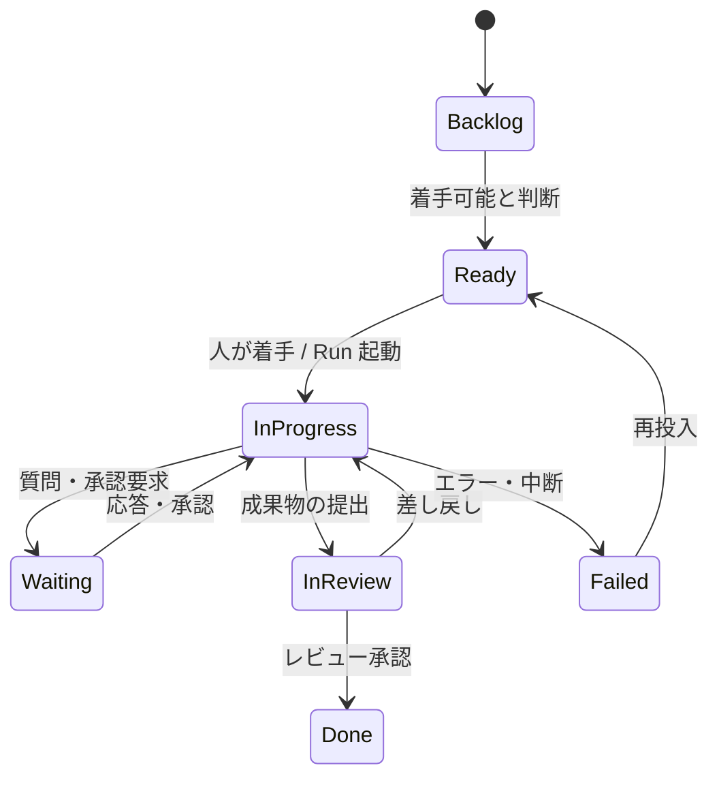

# ボードとカードの状態モデル

## カードの状態機械

カードの列 = 状態。エージェントの Run の状態はカードの状態として全ユーザに見える。

- **Waiting** は 2 種に分かれる：**入力待ち**（エージェントの質問への応答）と**承認待ち**（危険操作の承認、[approval.md](../permission/approval.md)）
- **InReview** は成果物レビュー関門。人の承認なしに Done へは進めない
- Failed → Ready の再投入時、同じカードに新しい Run が紐づく（Run の履歴はカードに蓄積）

## アサインモデル

- カードのアサイン先は**人間またはエージェント**。同格に扱う
- 典型パターン：エージェントが InProgress を担当し、人間がレビュアーとして InReview を担当
- エージェントへのアサイン = Template を選んで Run を起動すること（実行モデルは[タスク型](../decisions.md)）

## WIP 制限 = 同時実行スロット = コスト制御

InProgress 列の WIP 制限が、そのまま同時に走る Run 数の上限になる。カンバンの流量制御が LLM コストと計算資源の制御を兼ねる。制限超過分の Ready カードはキューとして待機する。

## 共有インボックス

Waiting のカードは**権限を持つ全ユーザが応答できる**。起動者の離席でエージェントが止まる問題を、チームの誰かが拾える構造で解く。これがローカルツールとの決定的な差。

- 「自分が応答すべきカード」（承認権者・アサイン済みレビュアー）を集めたビューを提供する
- 応答・承認の履歴は誰が行ったかを含めてカードに記録される（監査ログの一部）

## 未決

- ボードは自前実装とするか、GitHub Issues / Jira との同期を持つか（→ [decisions.md](../decisions.md) O4）
