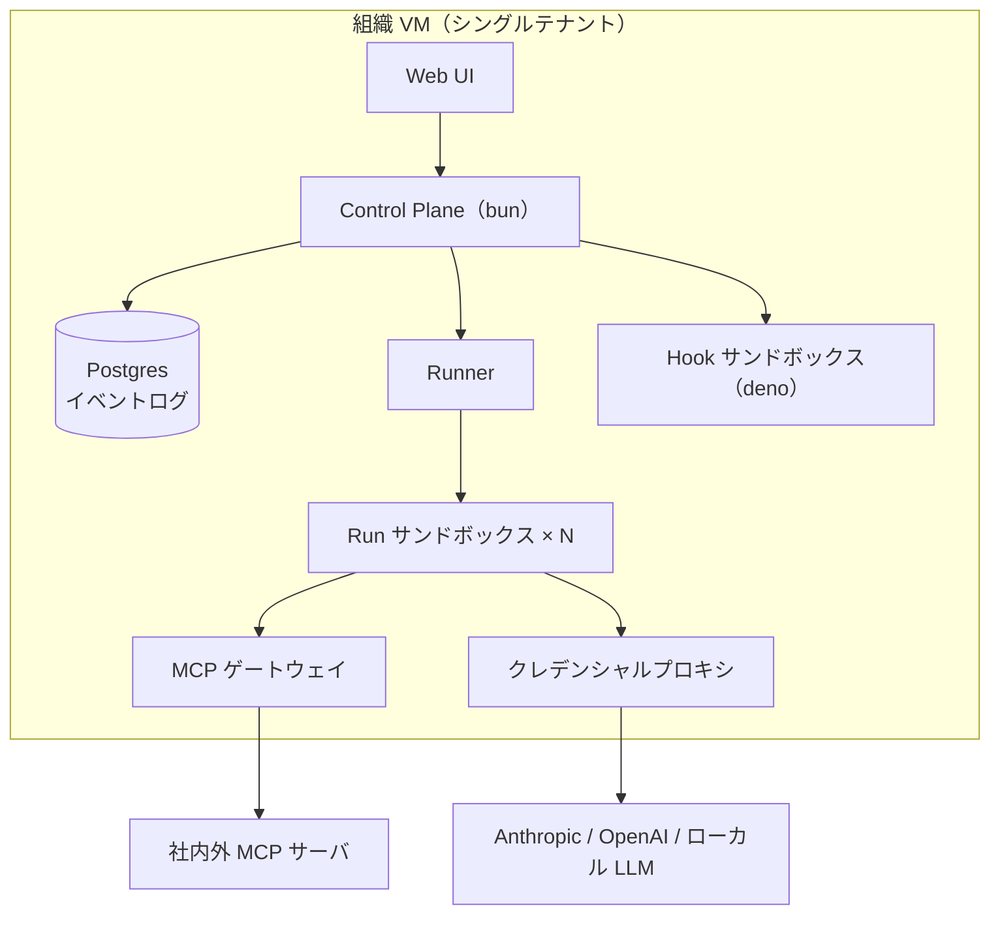

# 実行基盤とデプロイ形態

## デプロイ形態：1 組織 = 1 VM（決定 D3）

SaaS を志向するが、マルチテナントをアプリ内では作らない。**組織ごとに VM を 1 台プロビジョニングして一式を起動し、エンドポイントを渡す**。

- テナント分離 = VM 境界。アプリ自体は常にシングルテナントで設計でき、隔離の実装コストと事故リスクを大幅に下げる
- 当面はローカル完結（開発者のマシンや社内サーバで docker compose 一発起動）
- 将来の SaaS 化 = 「VM プロビジョニング + 課金」を担う management plane を外側に足すだけ。本体のスコープ外とする

## 全体構成

## コンポーネントと責務

| コンポーネント | 実装 | 責務 |
|---|---|---|
| Control Plane | bun（TypeScript） | API・WebSocket 配信・ボード状態・スケジューラ（WIP 制限に従い Ready から Run を起動） |
| Postgres | — | 全状態 + append-only イベントログ（監査・リアルタイム配信の源泉） |
| Runner | Control Plane 内 or 分離プロセス | Run ごとにサンドボックス付きプロセスを起動・監視・回収（バックエンド差し替え可） |
| Run サンドボックス | コンテナ（既定、D15）/ bwrap（Linux 軽量化オプション） | エンジン（Claude / Codex）と、それが spawn する全サブプロセスの実行境界。マウントテーブル由来の FS 制限を強制 |
| MCP ゲートウェイ | bun | MCP の ACL 判定・監査・レート制御（[permission/model.md](../permission/model.md)） |
| クレデンシャルプロキシ | bun | モデル API・外部アイデンティティのトークンを秘匿し代理実行・利用量記録（[../workspace/identity.md](../workspace/identity.md)） |
| Hook サンドボックス | deno | ユーザ定義フックの実行。deno の permission モデルでネットワーク・FS を絞った安全な実行 |

## bun / deno の役割分担

- **bun**：コントロールプレーン一式。速度と TypeScript エコシステム（Claude Agent SDK も TS）のため
- **deno**：ユーザ定義コード（hooks）の実行系。権限ゼロから明示的に許可を足せる sandbox 特性が、「他人の書いたフックを共有サーバで走らせる」要件に合う
- **プロセス隔離は OS サンドボックス層の仕事**：エージェントは任意のサブプロセス（bash・ビルドツール等）を spawn するため、JS ランタイムの権限モデルは境界にならない。FS/ネットワークの enforcement は OS サンドボックスで行う（下記）

## Run の隔離モデル（D12 → D15 改訂）

Run の隔離は **Runner バックエンド**として差し替え可能にし（D12）、既定は **`container`**（D15）。

- 「JS プロセス単位」の隔離では不十分：エージェントは任意のサブプロセスを spawn するため、隔離は JS ランタイムの外側に置く（D12、不変）
- **既定 = `container`**：D14 の二層構成により hard 層の役割は「worktree + ツールチェーン以外見えない粗い静的境界」に縮小し、コンテナの得意領域と一致する。イメージがツールチェーンを固定するため再現性（O13）も解決し、非 Linux 開発機でも実隔離が得られ、ネットワーク分離も容易（O12。Anthropic 公式 devcontainer も default-deny egress firewall 構成で先例になる）
- 実装の第一候補：Agent SDK の `spawnClaudeCodeProcess` フックで**エンジンプロセスだけをコンテナ内で起動**する（アダプタはコントロールプレーン内のまま、stdio はコンテナ越しに素通し）。マウントテーブルは volume 指定に翻訳
- **kw-runner イメージは自前ビルド**：Claude Code に公式配布イメージは無い（公式は devcontainer リファレンス + Dev Container Feature）。codex は `ghcr.io/openai/codex-universal` が参考になる。イメージ内 CLI と SDK のバージョン整合、エンジン認証情報（CLI の OAuth）の受け渡しが要設計
- `bwrap`：Linux 本番での軽量化オプション（起動即時・イメージ管理不要が効く場面）。`none`：非コンテナ環境での開発用（隔離なしを明示・警告）
- ネットワーク：M0 は「クレデンシャル不在＋プロキシ経由」を基本とし、コンテナのネットワークポリシーで強化する（O12）

## 未決

- サンドボックスのネットワーク分離の強度（O12）、ツールチェーン再現性（O13）
- 同時 Run 数の想定スケールとリソース制限（CPU / メモリ / トークン予算）
- リアルタイム配信の詳細（WebSocket + イベントログ tail の具体設計）
