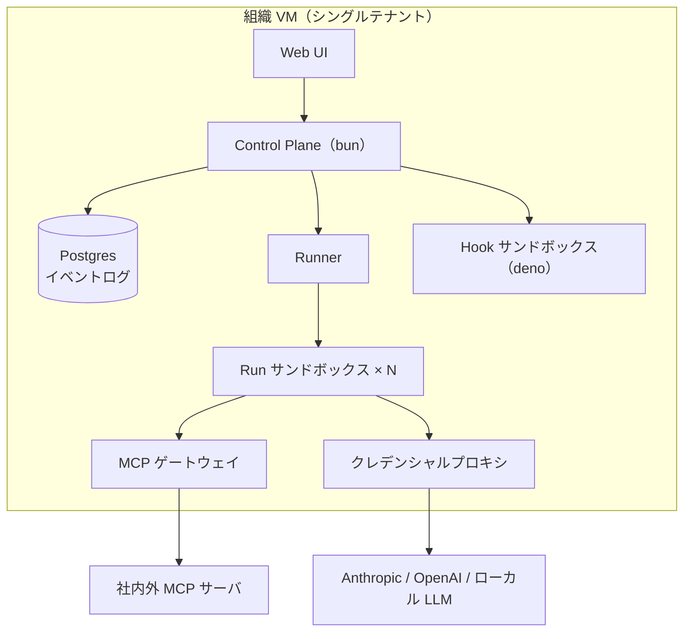

# 実行基盤とデプロイ形態

## デプロイ形態：1 組織 = 1 VM（決定 D3）

SaaS を志向するが、マルチテナントをアプリ内では作らない。**組織ごとに VM を 1 台プロビジョニングして一式を起動し、エンドポイントを渡す**。

- テナント分離 = VM 境界。アプリ自体は常にシングルテナントで設計でき、隔離の実装コストと事故リスクを大幅に下げる
- 当面はローカル完結（開発者のマシンや社内サーバで docker compose 一発起動）
- 将来の SaaS 化 = 「VM プロビジョニング + 課金」を担う management plane を外側に足すだけ。本体のスコープ外とする

## 全体構成

## コンポーネントと責務

| コンポーネント | 実装 | 責務 |
|---|---|---|
| Control Plane | bun（TypeScript） | API・WebSocket 配信・ボード状態・スケジューラ（WIP 制限に従い Ready から Run を起動） |
| Postgres | — | 全状態 + append-only イベントログ（監査・リアルタイム配信の源泉） |
| Runner | Control Plane 内 or 分離プロセス | Run ごとにサンドボックス付きプロセスを起動・監視・回収（バックエンド差し替え可） |
| Run サンドボックス | bwrap / Landlock（Linux）、Seatbelt（macOS 開発時） | エンジン（Claude / Codex）と、それが spawn する全サブプロセスの実行境界。マウントテーブル由来の FS 制限を強制 |
| MCP ゲートウェイ | bun | MCP の ACL 判定・監査・レート制御（[permission/model.md](../permission/model.md)） |
| クレデンシャルプロキシ | bun | モデル API・外部アイデンティティのトークンを秘匿し代理実行・利用量記録（[../workspace/identity.md](../workspace/identity.md)） |
| Hook サンドボックス | deno | ユーザ定義フックの実行。deno の permission モデルでネットワーク・FS を絞った安全な実行 |

## bun / deno の役割分担

- **bun**：コントロールプレーン一式。速度と TypeScript エコシステム（Claude Agent SDK も TS）のため
- **deno**：ユーザ定義コード（hooks）の実行系。権限ゼロから明示的に許可を足せる sandbox 特性が、「他人の書いたフックを共有サーバで走らせる」要件に合う
- **プロセス隔離は OS サンドボックス層の仕事**：エージェントは任意のサブプロセス（bash・ビルドツール等）を spawn するため、JS ランタイムの権限モデルは境界にならない。FS/ネットワークの enforcement は OS サンドボックスで行う（下記）

## Run の隔離モデル（決定 D12）

Run は Docker コンテナではなく、**OS サンドボックスを付けたホストプロセス**として起動する。

- 「JS プロセス単位」の隔離では不十分：エージェントは任意のサブプロセスを spawn するため、サンドボックスは JS ランタイムの外側・OS 層に置く必要がある
- 実装：Linux = bubblewrap（マウント名前空間 — マウントテーブルがそのまま bind 指定になる）+ cgroups / Landlock。macOS（開発時）= Seatbelt。Claude Code 自身がこの方式（Anthropic の sandbox-runtime）で動いており、実装候補として流用できる
- 十分性の根拠：テナント分離は VM 境界（D3）が担う。VM 内サンドボックスの目的は「同一組織内の権限強制」であり、名前空間 / Seatbelt で足りる。カーネルレベルの escape は VM 境界で受け止める
- 利点：起動が即時（イメージ管理なし）、Docker デーモン非依存、macOS 開発がそのまま動く
- **Runner はバックエンド差し替え可能**：`sandbox-process`（既定）/ `container`（再現可能なツールチェーンや強い隔離が必要な場合のオプション）。どちらもマウントテーブルの翻訳として実現する
- ネットワーク：M0 は「クレデンシャル不在＋プロキシ経由」を基本とし、ネットワーク名前空間の完全分離は強化課題（O12）

## 未決

- サンドボックスのネットワーク分離の強度（O12）、ツールチェーン再現性（O13）
- 同時 Run 数の想定スケールとリソース制限（CPU / メモリ / トークン予算）
- リアルタイム配信の詳細（WebSocket + イベントログ tail の具体設計）
