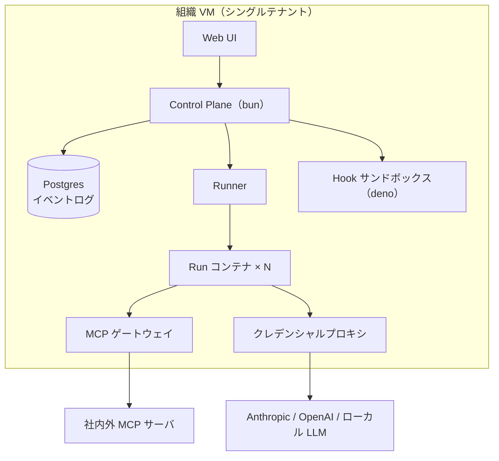

# 実行基盤とデプロイ形態

## デプロイ形態：1 組織 = 1 VM（決定 D3）

SaaS を志向するが、マルチテナントをアプリ内では作らない。**組織ごとに VM を 1 台プロビジョニングして一式を起動し、エンドポイントを渡す**。

- テナント分離 = VM 境界。アプリ自体は常にシングルテナントで設計でき、隔離の実装コストと事故リスクを大幅に下げる
- 当面はローカル完結（開発者のマシンや社内サーバで docker compose 一発起動）
- 将来の SaaS 化 = 「VM プロビジョニング + 課金」を担う management plane を外側に足すだけ。本体のスコープ外とする

## 全体構成

## コンポーネントと責務

| コンポーネント | 実装 | 責務 |
|---|---|---|
| Control Plane | bun（TypeScript） | API・WebSocket 配信・ボード状態・スケジューラ（WIP 制限に従い Ready から Run を起動） |
| Postgres | — | 全状態 + append-only イベントログ（監査・リアルタイム配信の源泉） |
| Runner | Control Plane 内 or 分離プロセス | Run ごとにコンテナを起動・監視・回収 |
| Run コンテナ | Docker 等 | エンジン（Claude / Codex）の実行環境。権限のあるパスだけをマウント |
| MCP ゲートウェイ | bun | MCP の ACL 判定・監査・レート制御（[permission/model.md](../permission/model.md)） |
| クレデンシャルプロキシ | bun | モデル API・外部アイデンティティのトークンを秘匿し代理実行・利用量記録（[../workspace/identity.md](../workspace/identity.md)） |
| Hook サンドボックス | deno | ユーザ定義フックの実行。deno の permission モデルでネットワーク・FS を絞った安全な実行 |

## bun / deno の役割分担

- **bun**：コントロールプレーン一式。速度と TypeScript エコシステム（Claude Agent SDK も TS）のため
- **deno**：ユーザ定義コード（hooks）の実行系。権限ゼロから明示的に許可を足せる sandbox 特性が、「他人の書いたフックを共有サーバで走らせる」要件に合う
- **プロセス隔離はコンテナ層の仕事**：Codex CLI は Rust バイナリであり、JS ランタイムの権限モデルでは縛れない。FS/ネットワークの enforcement はコンテナ（マウント・ネットワークポリシー）で行う

## 未決

- コンテナランタイム選定（Docker / Podman / より軽量な sandbox）と、VM なし開発モードでの隔離レベル
- 同時 Run 数の想定スケールとリソース制限（CPU / メモリ / トークン予算）
- リアルタイム配信の詳細（WebSocket + イベントログ tail の具体設計）
