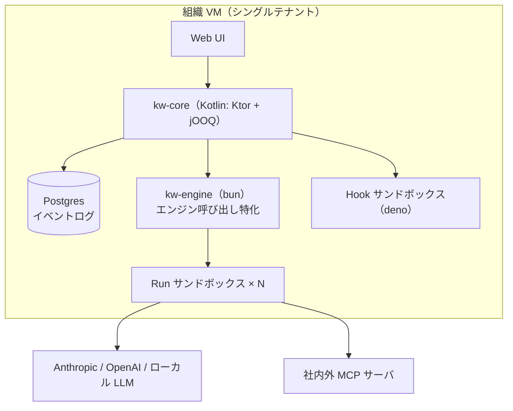

# 実行基盤とデプロイ形態

## デプロイ形態：1 組織 = 1 VM（決定 D3）

SaaS を志向するが、マルチテナントをアプリ内では作らない。**組織ごとに VM を 1 台プロビジョニングして一式を起動し、エンドポイントを渡す**。

- テナント分離 = VM 境界。アプリ自体は常にシングルテナントで設計でき、隔離の実装コストと事故リスクを大幅に下げる
- 当面はローカル完結（開発者のマシンや社内サーバで docker compose 一発起動）
- 将来の SaaS 化 = 「VM プロビジョニング + 課金」を担う management plane を外側に足すだけ。本体のスコープ外とする

## 全体構成

MCP ツールの制御は D14 の `mcp__*` permissions ルールで行う（中央ゲートウェイは監査・レート制御・動的昇格が必要になった時点で B7 として追加）。クレデンシャルプロキシは PoC では実装しない（D13）。

## コンポーネントと責務

| コンポーネント | 実装 | 責務 |
|---|---|---|
| kw-core | Kotlin（Ktor + jOOQ） | **唯一の公開 API**。ドメイン（ユーザ / リソース / ACL / 組織木 / 承認・ボード）・権限コンパイル（D14）・worktree 準備と checkpoint コミット・イベントログの永続化と UI への SSE 再投影・UI（Vite ビルド）の静的配信・スケジューラ |
| kw-engine | bun（TypeScript） | エンジン呼び出しに特化した軽量 API。Agent SDK / codex CLI を駆動して RunEvent を SSE で上流配信。状態は in-flight の Run のみ（永続化しない）。SDK↔CLI の内部プロトコルに触る唯一の場所 |
| Postgres | jOOQ 経由 | 全状態 + append-only イベントログ（監査・再投影・再水和の源泉） |
| Run サンドボックス | コンテナ（既定、D15）/ bwrap（Linux 軽量化オプション） | エンジン（Claude / Codex）と、それが spawn する全サブプロセスの実行境界。マウントテーブル由来の FS 制限を強制 |
| Hook サンドボックス | deno | ユーザ定義フックの実行。deno の permission モデルでネットワーク・FS を絞った安全な実行 |

## サービス間契約（D16）

- **runId は kw-core が採番**し、kw-engine に渡す（イベント相関の主導権は core）
- kw-engine の API：`POST /runs`（cwd・prompt・コンパイル済み permissions・env を受けて起動）/ `GET /runs/:id/events`（RunEvent の SSE、`id`=seq で Last-Event-ID 再開）/ `POST messages・permissions/:requestId・end`
- **core が engine の SSE を購読して Postgres に永続化し、UI へは core 自身の SSE で再投影**する。「ログが真実・配信は投影」の担い手は core の DB（UI クライアントの再接続・途中参加・サーバ再起動後の再水和はすべてログから復元）
- RunEvent（[@kw/shared](../../packages/shared/src/events.ts)）が言語間契約。JSON Schema 化して Kotlin 側の型を生成する

## 言語と役割分担（D16）

- **Kotlin（kw-core）**：ドメインモデリング（組織木・ACL・承認）と永続化。Ktor + jOOQ
- **bun / TypeScript（kw-engine + Web UI）**：Agent SDK が TS のため、エンジン駆動は特化サービスとして bun に残す。UI は React/TS（Vite ビルドを core が配信）
- **deno**：ユーザ定義コード（hooks）の実行系。権限ゼロから明示的に許可を足せる sandbox 特性が、「他人の書いたフックを共有サーバで走らせる」要件に合う
- **プロセス隔離は OS サンドボックス層の仕事**：エージェントは任意のサブプロセス（bash・ビルドツール等）を spawn するため、JS ランタイムの権限モデルは境界にならない。FS/ネットワークの enforcement は OS サンドボックスで行う（下記）

## Run の隔離モデル（D12 → D15 改訂）

Run の隔離は **Runner バックエンド**として差し替え可能にし（D12）、既定は **`container`**（D15）。

- 「JS プロセス単位」の隔離では不十分：エージェントは任意のサブプロセスを spawn するため、隔離は JS ランタイムの外側に置く（D12、不変）
- **既定 = `container`**：D14 の二層構成により hard 層の役割は「worktree + ツールチェーン以外見えない粗い静的境界」に縮小し、コンテナの得意領域と一致する。イメージがツールチェーンを固定するため再現性（O13）も解決し、非 Linux 開発機でも実隔離が得られ、ネットワーク分離も容易（O12。Anthropic 公式 devcontainer も default-deny egress firewall 構成で先例になる）
- 実装の第一候補：Agent SDK の `spawnClaudeCodeProcess` フックで**エンジンプロセスだけをコンテナ内で起動**する（アダプタはコントロールプレーン内のまま、stdio はコンテナ越しに素通し）。マウントテーブルは volume 指定に翻訳
- **kw-runner イメージは自前ビルド**：Claude Code に公式配布イメージは無い（公式は devcontainer リファレンス + Dev Container Feature）。codex は `ghcr.io/openai/codex-universal` が参考になる。イメージ内 CLI と SDK のバージョン整合、エンジン認証情報（CLI の OAuth）の受け渡しが要設計
- `bwrap`：Linux 本番での軽量化オプション（起動即時・イメージ管理不要が効く場面）。`none`：非コンテナ環境での開発用（隔離なしを明示・警告）
- ネットワーク：M0 は「クレデンシャル不在＋プロキシ経由」を基本とし、コンテナのネットワークポリシーで強化する（O12）

## 未決

- サンドボックスのネットワーク分離の強度（O12）、ツールチェーン再現性（O13）
- 同時 Run 数の想定スケールとリソース制限（CPU / メモリ / トークン予算）
- リアルタイム配信の詳細（WebSocket + イベントログ tail の具体設計）
